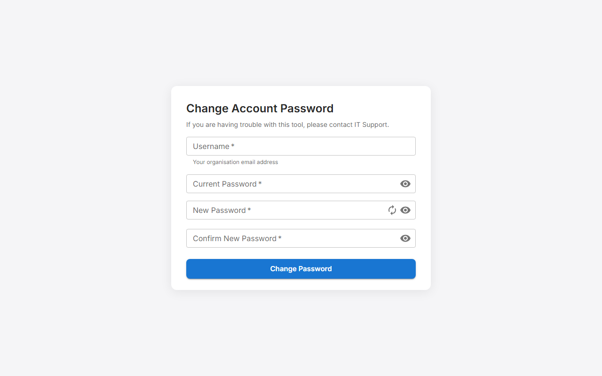

# AD-Passreset-Portal

> Self-service Active Directory password change portal. Employees change their own password in a browser — no helpdesk call needed.

[](https://github.com/phibu/AD-Passreset-Portal/releases)
[](LICENSE)

<picture>
  <source media="(prefers-color-scheme: dark)" srcset="docs/screenshot-dark.png">
  <source media="(prefers-color-scheme: light)" srcset="docs/screenshot.png">
  
</picture>

---

## Features overview

AD-Passreset-Portal is a self‑service Active Directory password change portal that lets employees change their own Windows domain password from any browser. It combines real‑time password validation, breach‑checking, and portal‑level lockout to protect Active Directory accounts.

## Features

| Feature | What it does |
|---|---|
| Self-service password change | Users change their own AD password from any browser |
| Password strength meter | Live feedback while you type, powered by zxcvbn |
| Password generator | Creates a strong password for you on demand |
| Breach database check | Blocks passwords found in known data breaches (HaveIBeenPwned) |
| reCAPTCHA v3 | Optional bot protection with Google reCAPTCHA — no user interaction required |
| Password-changed email | Notifies the user by email after a successful change |
| Expiry reminder emails | Daily reminders before a password is about to expire |
| Flexible username formats | Accept SAM account name (`jdoe`), UPN (`jdoe@company.com`), or email address — configurable |
| Portal lockout | Blocks further attempts after a configurable number of wrong passwords, protecting the AD account from lockout |
| Approaching-lockout warning | Shows a banner when one more wrong attempt will trigger the portal block |
| AD group allow/block lists | Restrict which users can self-serve; block list takes priority |
| Minimum password age | Respects the AD `minPwdAge` policy — prevents changing too soon after the last change |
| Must-change-at-next-logon | Clears the "must change at next logon" flag after a successful change |
| Configurable notification email | Choose how the recipient address is resolved: AD mail attribute, UPN, SAM@domain, or a custom template |
| SIEM integration | Forward security events to a syslog collector (RFC 5424, UDP/TCP) and/or email alerts for selected event types |
| Rate limiting | 5 requests per 5 minutes per IP address |
| Security headers | CSP, HSTS, X-Frame-Options DENY, nosniff, Referrer-Policy |
| Debug mode | Test the full UI without an AD connection |

---

## Tech Stack

AD-Passreset-Portal is a .NET 10‑based Active Directory password‑change portal built with ASP.NET Core, React, and Material UI. It runs on Windows Server under IIS and integrates directly with Active Directory via `System.DirectoryServices.AccountManagement`.

| Layer | Technology |
|---|---|
| Runtime | .NET 10 LTS (cross-platform as of v2.0) |
| Web framework | ASP.NET Core |
| AD integration | Windows: `System.DirectoryServices.AccountManagement`. Linux/macOS: `System.DirectoryServices.Protocols` (LDAPS). |
| Email | MailKit (STARTTLS / SMTPS / SMTP relay) |
| Frontend | React 19 + TypeScript |
| UI components | Material UI v6 |
| Build tool | Vite |
| Deployment | IIS 10 on Windows Server (2019, 2022, 2025), or any Linux / Docker host (v2.0+) |

### Platform support

| Platform | Status | Provider | Setup guide |
|---|---|---|---|
| Windows Server 2019 / 2022 / 2025 (IIS) | Supported | Windows (default) | [`docs/IIS-Setup.md`](docs/IIS-Setup.md) + [`docs/AD-ServiceAccount-Setup.md`](docs/AD-ServiceAccount-Setup.md) |
| Linux (any `net10.0` host) | Supported (v2.0+) | LDAP | [`docs/AD-ServiceAccount-LDAP-Setup.md`](docs/AD-ServiceAccount-LDAP-Setup.md) |
| macOS / Docker | Supported (v2.0+) | LDAP | [`docs/AD-ServiceAccount-LDAP-Setup.md`](docs/AD-ServiceAccount-LDAP-Setup.md) |

Existing Windows deployments upgrade to v2.0 with no config changes — `PasswordChangeOptions.ProviderMode` defaults to `Auto`, which selects the Windows provider on Windows.

---

## Requirements

To run AD-Passreset-Portal as an Active Directory password‑change portal, you need:

- Windows Server 2022 (recommended) — 2019 and 2025 also supported
- IIS 10
- [.NET 10 Hosting Bundle](https://dotnet.microsoft.com/download/dotnet/10.0)
- Domain-joined server (recommended) or an AD service account with LDAP credentials
- SSL certificate bound to the IIS site

---

## Deployment and installation

Download the latest release zip from [GitHub Releases](https://github.com/phibu/AD-Passreset-Portal/releases) and install AD-Passreset-Portal as an IIS‑hosted Active Directory password‑change portal on Windows Server.

```powershell
# Fresh install
.\Install-PassReset.ps1 -CertThumbprint "YOUR_CERT_THUMBPRINT"

# Upgrade over an existing installation
# Shows a version comparison, creates a dated backup, then overwrites.
# -Force skips the confirmation prompt.
.\Install-PassReset.ps1 -Force -CertThumbprint "YOUR_CERT_THUMBPRINT"

# Uninstall
.\Uninstall-PassReset.ps1
```

Full installation guide: [`docs/IIS-Setup.md`](docs/IIS-Setup.md)
AD service account and permissions: [`docs/AD-ServiceAccount-Setup.md`](docs/AD-ServiceAccount-Setup.md)

---

## Configuration

Settings live in `appsettings.Production.json`, created by the installer at `C:\inetpub\PassReset\`.

The most commonly changed keys:

| Key | What it controls |
|---|---|
| `PasswordChangeOptions.AllowedUsernameAttributes` | Which username formats users can enter: `samaccountname`, `userprincipalname`, or `mail` |
| `PasswordChangeOptions.PortalLockoutThreshold` | Wrong-password attempts before the portal blocks the user (default: `3`) |
| `PasswordChangeOptions.PortalLockoutWindow` | How long the portal block lasts (default: `"00:30:00"` — 30 minutes) |
| `PasswordChangeOptions.UseAutomaticContext` | Set `true` on a domain-joined server — no LDAP credentials needed |
| `SmtpSettings.Host` | SMTP relay hostname — leave empty to disable all email |

Full configuration reference: [`docs/appsettings-Production.md`](docs/appsettings-Production.md)

---

## Project Structure

```
src/
  PassReset.Common/           — shared interfaces and error types
  PassReset.PasswordProvider/ — Active Directory integration (Windows-only)
  PassReset.Web/              — ASP.NET Core app + React frontend
deploy/
  Publish-PassReset.ps1       — builds and packages a release zip
  Install-PassReset.ps1       — installs or upgrades on IIS
  Uninstall-PassReset.ps1     — removes the installation from IIS
docs/
  IIS-Setup.md                     — step-by-step IIS and certificate guide (Windows)
  AD-ServiceAccount-Setup.md       — Active Directory permissions guide (Windows)
  AD-ServiceAccount-LDAP-Setup.md  — service account + LDAPS trust for Linux / LDAP mode
  appsettings-Production.md        — full configuration reference
  Secret-Management.md             — credential handling and hardening options
  Known-Limitations.md             — documented constraints and trade-offs
```

---

## Quick Start — Development

**Prerequisites:** [.NET 10 SDK](https://dotnet.microsoft.com/download/dotnet/10.0), [Node.js 20+](https://nodejs.org/)

```bash
# Backend — runs on https://localhost:5001
cd src/PassReset.Web
dotnet run

# Frontend — hot-reload dev server, proxies /api to the backend
cd src/PassReset.Web/ClientApp
npm ci
npm run dev
```

### Debug mode (no AD required)

In `src/PassReset.Web/appsettings.Development.json`:

```json
{
  "WebSettings": {
    "UseDebugProvider": true
  }
}
```

Use these usernames to trigger specific states:

| Username | Result |
|---|---|
| *(anything else)* | Success |
| `error` | Generic server error |
| `invalidCredentials` | Wrong current password |
| `userNotFound` | User not found |
| `changeNotPermitted` | Change not allowed |
| `pwnedPassword` | Password blocked by breach check |
| `passwordTooYoung` | Password changed too recently |

---

## API

AD-Passreset-Portal exposes a minimal REST API for the self‑service password‑change portal, allowing integration with other tools or dashboards.


| Method | Endpoint | Description |
|---|---|---|
| `GET` | `/api/password` | Returns UI settings (labels, feature flags, validation rules) |
| `POST` | `/api/password` | Submit a password change |
| `GET` | `/api/health` | Health check (returns 200 healthy / 503 degraded with AD connectivity status) |

---

## Security

PassReset is designed for handling Active Directory credentials securely:

- HTTPS enforced with HSTS (1-year max-age)
- Comprehensive CSP, X-Frame-Options DENY, nosniff, Referrer-Policy
- Per-IP rate limiting (5 req / 5 min) + per-username portal lockout
- HaveIBeenPwned breach check via k-anonymity (password never leaves the server)
- reCAPTCHA v3 bot protection (optional)
- Privileged AD groups blocked by default
- Passwords never logged, stored, or returned in API responses
- SIEM integration for all security events

For vulnerability reporting, see [`SECURITY.md`](SECURITY.md).
Known constraints and trade-offs: [`docs/Known-Limitations.md`](docs/Known-Limitations.md).

---

## Support

For issues and feature requests, open an issue at [github.com/phibu/AD-Passreset-Portal/issues](https://github.com/phibu/AD-Passreset-Portal/issues).

---

## License

MIT — © 2024–2026 phibu ([github.com/phibu](https://github.com/phibu))

Inspired by [PassCore](https://github.com/unosquare/passcore) by Unosquare LLC (MIT).
See [LICENSE](LICENSE) for full text and attribution.
